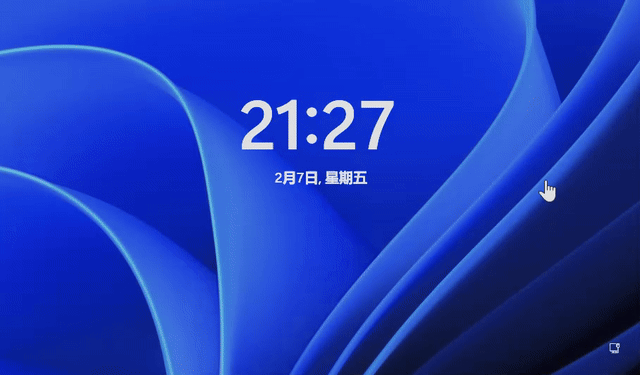

# Lock Screen CMD

Invoke a **command line** with SYSTEM privileges by tapping the "**Accessibility**" button on the lock screen.

## How it works?

By replacing **Utilman.exe** in the system32 directory with **cmd.exe**.

## How to use?

Double-click on **ENABLE.bat** to enable, and double-click on **DISABLE.bat** to disable.

## Tools

**run_as_admin**: Request administrator privileges and run command.

**extract_one_file**: Unzip one of the files in the archive.

**sfpcopy**: A tool that allows copying a protected system file.

## About sfpcopy

The sfpcopy tool is included in the Windows 10 IoT Core Packages, and as far as I know it's not open source, it's available from this [Microsoft website](https://www.microsoft.com/en-us/download/details.aspx?id=53898).

It is located in the following directory:

`14393.67.160804-2231.rs1_release_amd64fre_IOTCORE_PACKAGES.iso\Windows_10_IoT_Core_X64_Packages.msi\fil4cfed34a04a06069f08b7eca0e5b1f17\amd64_microsoft-windows-sfpcopy_31bf3856ad364e35_10.0.14393.67_none_0e3eefda7177f36e`

You can manually copy sfpcopy.exe to the tools directory after the download is complete before running ENABLE.bat, otherwise the script will automatically download it via Invoke-WebRequest and extract it via extract_one_file.

## Requirements

1. [.Net Framework SDK 4.7.2](https://dotnet.microsoft.com/zh-cn/download/dotnet-framework/net472) (for building run_as_admin)
2. [Bit7z](https://github.com/rikyoz/bit7z) (for building extract_one_file)
3. [7z.dll](https://www.7-zip.org/) (for running extract_one_file)

## How to build?

1. Open tools\LockScreenCMDTools.sln 
2. Configure the Bit7z lib.
3. Build.
4. Copy the ouput extract_one_file.exe and run_as_admin.exe to the **tools** directory.

## Additional

You can recover lost system files with the `sfc /scannow` command
